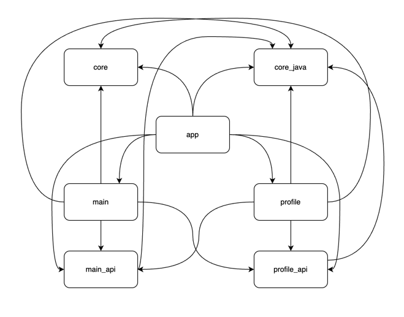

# Project description

Current project shows how we can implement multi module concept. I didn't use DI Framework and others due to achieve simple android clear project that contains only a main structure about multi module topic.  

There are two features: main and profile and two api respectively. And there are also two most common use cases which occurs in practice:
- navigation between modules
- sharing business logic between modules

In current project api modules were created as a common java modules for increasing performance. 

The relationships between modules can be seen in the picture:
